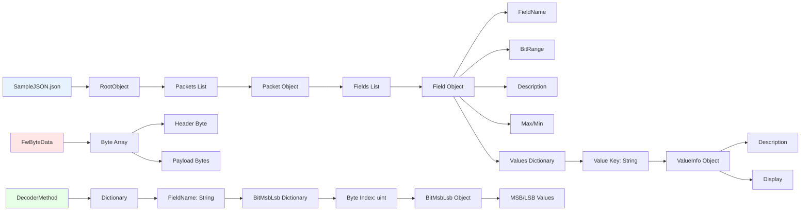
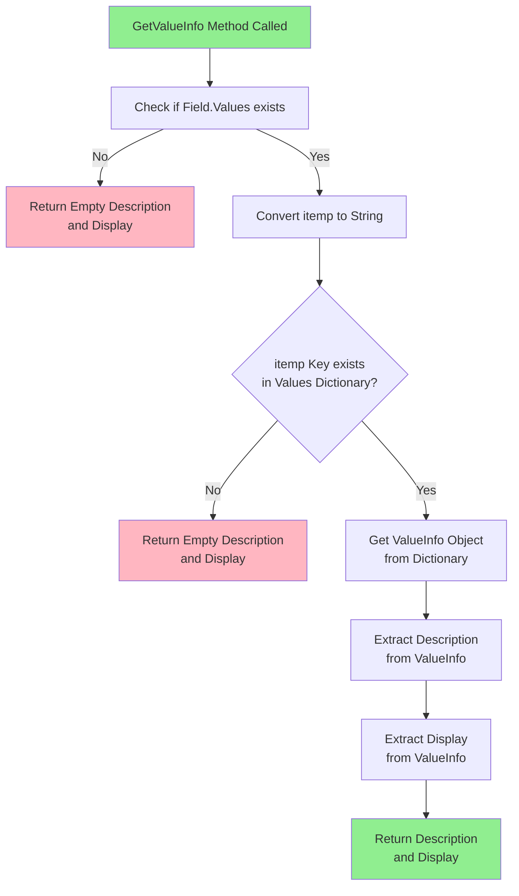
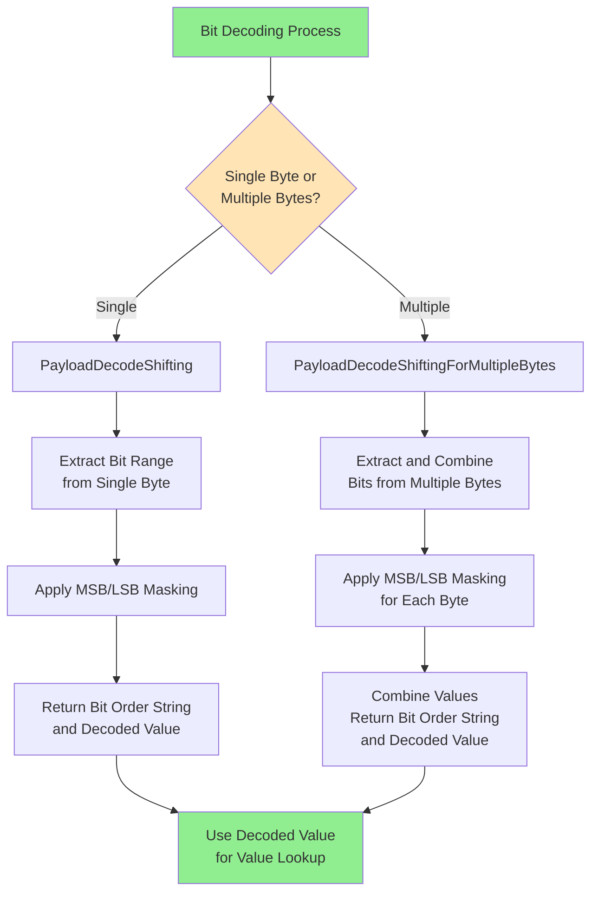
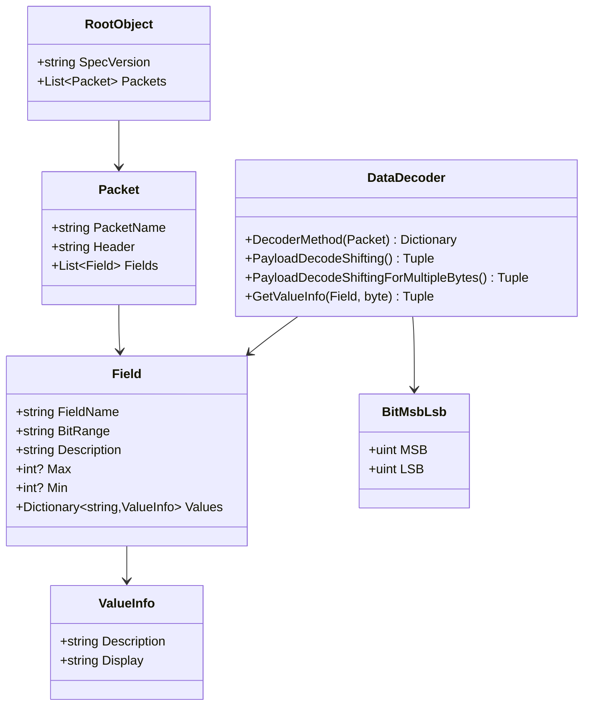

# JSON Packet Decode Flow Diagram

This document contains Mermaid flow diagrams that visualize the JSON packet decoding process implemented in the JSONPacketDecode project.

## Main Process Flow

```mermaid
flowchart TD
    A[Start Program] --> B[Initialize DataDecoder]
    B --> C[Create FwByteData List]
    C --> D[Add Test Bytes: 0x25, 0x31, 0x42]
    D --> E[Read SampleJSON.json File]
    E --> F[Deserialize JSON to RootObject]
    F --> G[Loop Through Each Packet in JSON]
    
    G --> H{Does Header Match<br/>FwByteData[0]?}
    H -->|No| G
    H -->|Yes| I[Create DisplayPayloadvalues List]
    
    I --> J[Call DecoderMethod<br/>to get BitRange Dictionary]
    J --> K{FwByteData.Count > 1?}
    K -->|No| G
    K -->|Yes| L[Print Packet Name]
    
    L --> M[Loop Through Each Field<br/>in BitRange Dictionary]
    M --> N[Extract Payload Name<br/>and BitInfo Dictionary]
    N --> O[Find Corresponding Field<br/>in Packet.Fields]
    
    O --> P{BitInfoDict.Count == 1?}
    P -->|Yes| Q[Call PayloadDecodeShifting<br/>for Single Byte]
    P -->|No| R[Call PayloadDecodeShiftingForMultipleBytes<br/>for Multiple Bytes]
    
    Q --> S[Get strbitorder and itemp]
    R --> T[Get strbitorder and itempdata<br/>Convert to byte]
    
    S --> U[Check if Field has Values<br/>Call GetValueInfo]
    T --> U
    
    U --> V{Values Found?}
    V -->|Yes| W[Extract Description<br/>and Display from Values]
    V -->|No| X[Set Empty Description<br/>and Display]
    
    W --> Y[Add to DisplayPayloadvalues]
    X --> Y
    
    Y --> Z[Print Field Information:<br/>- Payload Name<br/>- Bit Order<br/>- Decoded Value<br/>- Description (if available)<br/>- Display (if available)]
    
    Z --> AA{More Fields<br/>to Process?}
    AA -->|Yes| M
    AA -->|No| BB[Print Display String<br/>with All Payload Values]
    
    BB --> CC{More Packets<br/>to Process?}
    CC -->|Yes| G
    CC -->|No| DD[End Program]

    style A fill:#90EE90
    style DD fill:#FFB6C1
    style H fill:#FFE4B5
    style K fill:#FFE4B5
    style P fill:#FFE4B5
    style V fill:#FFE4B5
    style AA fill:#FFE4B5
    style CC fill:#FFE4B5
```

## Data Structures Flow



## Value Lookup Process



## Bit Decoding Process



## Sample Data Processing Example

```mermaid
flowchart TD
    A[Sample Data: 0x25, 0x31, 0x42] --> B[Header: 0x25]
    B --> C[Match with ADC Packet<br/>Header: 0x25]
    C --> D[Process Request Field<br/>BitRange: B0-b7:b3]
    D --> E[Extract Bits 7-3<br/>from Byte 0 (0x25)]
    E --> F[Decoded Value: 4<br/>Binary: 00100101<br/>Bits 7-3: 00100 = 4]
    F --> G{Check Values Dictionary<br/>for Key "4"}
    G -->|Found| H[No match in Values<br/>Return empty Description/Display]
    G -->|Not Found| I[Check for Key "5"<br/>for reset operation]
    
    D --> J[Process Parameter Field<br/>BitRange: B0-b2:b0|B1-b7:b0]
    J --> K[Extract Bits 2-0 from B0<br/>and Bits 7-0 from B1]
    K --> L[B0 bits 2-0: 101 = 5<br/>B1 all bits: 0x31 = 49]
    L --> M[Combined Value:<br/>(5) + (49 << 3) = 397]

    style A fill:#E6F3FF
    style F fill:#90EE90
    style M fill:#90EE90
```

## Class Relationships



## Key Features

1. **Header Matching**: The system matches the first byte of `FwByteData` with packet headers in the JSON
2. **Bit Range Parsing**: Complex bit ranges like "B0-b7:b3" and "B0-b2:b0|B1-b7:b0" are parsed and processed
3. **Value Lookup**: Decoded values are matched against the Values dictionary to provide meaningful descriptions
4. **Multi-byte Support**: The system handles both single-byte and multi-byte field extractions
5. **Display Formatting**: Results are formatted for easy reading with packet names, field names, and values

## Sample Output Format

```
Packet Name : Auxiliary Data Control (ADC)
    Payload Name : Request
    Bit Order : [bit order string]
    Decoded Value : 4
    Description : [from Values if available]
    Display : [from Values if available]
    ----------------------------------
    Display String : Auxiliary Data Control (ADC)[0x25] - Request : 4| Parameter : 397
```
